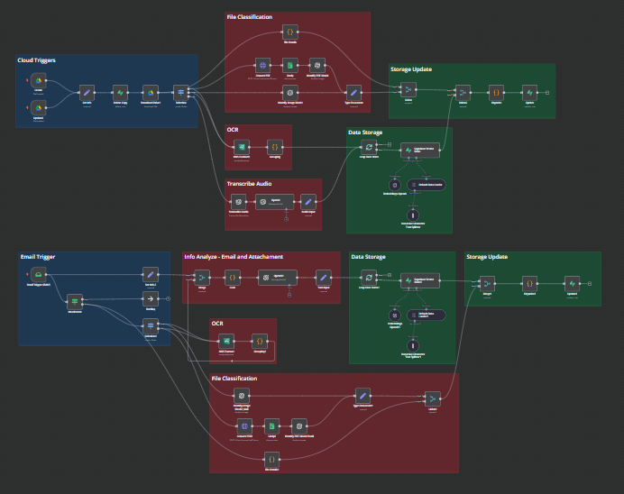

# N8N Workflow - Core Document, Audio & Text Processing (Financial)

This project integrates **N8N**, **Supabase**, **OpenAI**, **AWS Textract**, **Email**. **Stirling PDF** and **Google Drive** to process, store, and retrieve documents efficiently using **semantic search based on embeddings**. The workflow follows a structured approach, starting with **data ingestion**, followed by **classification and processing**, and finally **storing and querying the data in Supabase**.

---

## Workflow Overview

### **Step 1: Data Ingestion (Triggers)**
- **Google Drive Trigger**: Detects newly added or updated files in a specified folder.
- **IMAP Email Trigger**: Monitors an email inbox for new emails.
- **Email Processing (No Attachment Upload)**:
  - The workflow **does not upload** attachments from emails.
  - Instead, it **extracts relevant financial data** from the email body and attachments using **OpenAI NLP**.
  - Stores **only key extracted information** in Supabase.

### **Step 2: File Classification & Processing**
- **File Type Detection**: Identifies whether the file is a **PDF, image, or audio**.
- **OCR Processing**: Uses **AWS Textract** to extract text from PDFs and images.
- **Audio Transcription**: Uses **OpenAI Whisper** to transcribe audio files.
- **Metadata Extraction**: Extracts details such as **file name, extension, and document type**.
- **Stirling PDF**: Convert PDF in Image to classify the document type.

### **Step 3: Data Storage & Search**
- **Vector Embedding Generation**: Uses **OpenAI Embeddings** to generate semantic vector representations of the extracted text.
- **Storage in Supabase**: Saves extracted text, metadata, and embeddings into the **Supabase Vector Store (pgvector)**.

  **Additional Futures Actions:**
    - **Semantic Search**: Enables searching for similar documents based on content rather than keywords.

### **Step 4: Error Notifications**
- **Alerts**: Captures errors and sends alerts via **Gmail**.

---

## Authentication Requirements

To operate, the workflow requires credentials for multiple services:

1️ - **Google Drive API** → Required for monitoring and retrieving files.  
2️ - **IMAP Authentication** → Necessary for fetching email content (without attachments).  
3️ - **AWS Textract API** → Used for Optical Character Recognition (OCR).  
4️ - **OpenAI API** → Extracts relevant financial data and generates embeddings.  
5️ - **Supabase API** → Stores metadata and vector embeddings.  

Each service requires API keys or OAuth authentication, configured within N8N.

---

## Database Structure in Supabase

The database schema is designed to store documents, metadata, and vector embeddings efficiently:

| Column Name     | Type                   | Description                                               |
|----------------|------------------------|------------------------------------------------------------|
| `id`           | inte8                   | Unique identifier for each record.                        |
| `fileName`     | TEXT                    | File's Name.                                              |
| `typeDocument` | TEXT                    | Document Models (W-2, 1099, Business Invoice and Audio).  |
| `fileType `    | TEXT                    | File's Extension.                                         |
| `content`      | TEXT                    | Extracted financial data from email and documents.        |
| `metadata`     | JSONB                   | Additional metadata (e.g., OpenAI response).              |
| `embedding`    | VECTOR (1536)           | Vector representation for semantic search.                |

**Notes:** Information received via email, such as customer data (sender, email, subject and email's date), is treated together with the financial information included within the content.

**Why use Supabase Vector Store?**
- **Faster retrieval** → Allows similarity-based search instead of exact matches.
- **Efficient handling of embeddings** → Uses **pgvector** to store and query vectors.

---

## N8N Workflow Step-by-Step

### Step 1: Fetching Emails & Files
- **Google Drive Trigger**: Detects new files in a specified folder.
- **IMAP Email Trigger**: Monitors inbox for new emails **(without storing attachments on cloud)**.
- **Extracts financial data from email body and attachments using OpenAI NLP**.

**Nodes Involved**:
- `Google Drive Trigger`
- `Email Read IMAP`
- `OpenAI GPT` (Financial data extraction from email content)

---

### Step 2: Classifying and Processing Documents
- **File Type Identification**: Checks if the file is a **PDF, image, or audio**.
- **Text Extraction (OCR)**:
  - If **PDF or Image**, use **AWS Textract** to extract text.
  - If **Audio**, use **OpenAI Whisper** for transcription.
- **Metadata Extraction**:
  - Uses `Set` and `Code` nodes to structure metadata for storage.

**Nodes Involved**:
- `AWS Textract` (OCR for PDFs & Images)
- `OpenAI Whisper` (Transcription for audio files)
- `Set Info` (Organizes extracted data)

---

### Step 3: Storing Data in Supabase
- **Save extracted financial data from emails** (Sender, Subject, Date, and extracted content).
- **Generate embeddings** using **OpenAI API**.
- **Store embeddings in Supabase Vector Store** for semantic search.

**Nodes Involved**:
- `Supabase Insert` (Stores extracted data).
- `Embeddings OpenAI` (Transforms text into vector embeddings).
- `Supabase Vector Store` (Stores embeddings in pgvector).

---

### Step 4: Performing Semantic Search
- When a user searches for financial data, the **Supabase Vector Store** retrieves the most relevant emails/documents based on semantic similarity using.

**Nodes Involved**:
- `Supabase Vector Store` (Performs similarity search).

---

### Step 5: Error Handling & Notifications
- If a process fails, the workflow captures the error and sends an alert via email.
- Logs the error for debugging purposes.

**Nodes Involved**:
- `Error Trigger` (Captures errors).
- `Gmail` (Sends email notifications).
- `Set Data` (Formats error details).

---

## Challenges Faced

1 - **Multi-Service Authentication**  
  - Configuring API keys and OAuth for Google Drive, AWS, OpenAI, and Supabase required careful management.  

2️ - **Extracting Financial Data Instead of Storing Full Emails**  
   - Instead of storing entire email content and attachments, **OpenAI extracts only relevant financial details after analyze both together**.  
   - This approach **reduces storage size** and **improves search accuracy**.  

3️ - **Optimizing Semantic Search**  
   - Fine-tuned **pgvector** for efficient similarity-based financial data retrieval.  

4️ - **Error Handling & Logging**  
   - Added **error alerts** via **Gmail** for failures in document extraction and processing.  

5 - **Limited Knowledge of JavaScript**
  - Implementing custom JavaScript functions in N8N was a challenge due to a lack of experience with the language.
  - Debugging scripts and handling data transformations required additional learning.
  - Using JavaScript in Function Nodes for tasks like data extraction, error handling, and API requests added complexity for someone unfamiliar with the language.

## Conclusion

This N8N workflow **automates financial data extraction from emails**, integrates semantic search, and efficiently manages document metadata using **Supabase, OpenAI, AWS, and Google Drive**.

**Future Improvements**  
- Improve financial entity extraction with **domain-specific NLP models**.  
- Optimize **vector search performance** using **hybrid retrieval** methods.  
- Implement **role-based access control (RBAC)** for better data security. 